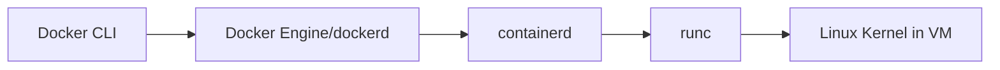
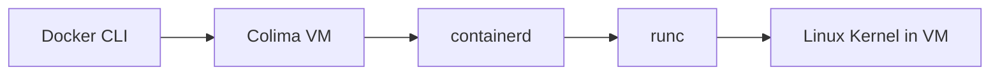
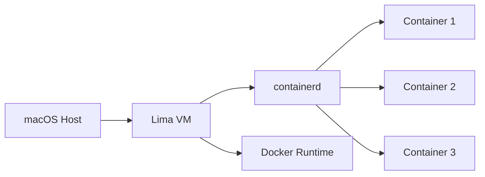

# From Docker Desktop 
# to Colima
Lightweight Docker Alternative for macOS

---

# Understanding Container Fundamentals

## Container Runtime
- Low-level software that runs and manages containers
- Examples: containerd, CRI-O, runc
- Handles container lifecycle (create, start, stop etc.), storage, and networking

## Docker Engine (Daemon)
- Complete container platform
- Built on top of containerd
- Provides higher-level features: build, push, pull, etc.


---

# Understanding Container Technology Layers

## Docker Desktop Architecture


<br>
<br>
<br>

## Colima Architecture


---
layout: two-cols
---

# Component Roles
1. **Docker Engine/dockerd**:
   - Complete container platform
   - Image building
   - Volume & network management
   - API endpoints

2. **containerd** (High-level Runtime):
   - Container lifecycle
   - Image management
   - Storage operations

::right::

3. **runc** (Low-level Runtime):
   - Creates actual containers
   - Interfaces with kernel
   - Manages system resources

---

# Docker Desktop vs Colima

Docker Desktop:
- Complete GUI application
- Built-in Kubernetes
- Resource-heavy
- Commercial licensing

Colima:
- Open source
- CLI-based
- Lightweight
- Uses same container runtime

---

# Why Migrate from Docker Desktop?
- FREE for all use cases
- Lightweight alternative
- Better resource management
- Native support for Apple Silicon
- Same underlying technology

---

# How Colima Works



- Uses Lima to create a Linux VM
- Runs containerd inside VM
- Provides Docker API compatibility

---

# Prerequisites
```bash
# Install required packages
brew install colima docker docker-compose
```

Key Components:
- `colima`: VM manager
- `docker`: CLI tools
- `docker-compose`: Container orchestration

---

# Getting Started

```bash
# Start Colima
colima start

# Verify installation
docker ps
docker-compose version

# Check Colima status
colima status
```

---

# Container Runtime Configuration

```bash
# Default configuration
colima start

# With custom resources
colima start --cpu 4 --memory 8

# With specific runtime
colima start --runtime containerd

# Advance configuration by editing
~/.colima/default/colima.yml
```

---

# Handling TLS Issues

```bash
# Stop Colima
colima stop

# Start with insecure registry configuration
colima start --runtime containerd --containerd-insecure-registry "registry-1.docker.io"
```

Common registry issues:
- Certificate verification
- Registry authentication
- Network connectivity

---

# Handling TLS Issues (cont.)

```bash
# Common issues
error getting credentials - err: exec: "docker-credential-desktop": executable file not found in $PATH, out: ``
```
Solution
- Open `~/.docker/config.json` with code editor

```json
{
	"auths": {},
	"currentContext": "colima"
}
```

---

# Handling TLS Issues (cont.)

```bash
# Common issues
Error: https://registry-1.docker.io/v2/: x509: certificate signed by unknown authority
```
Solution
- Edit `~/.colima/colima.yml` with code editor by adding the following:

```yaml
docker:
  insecure-registries:
    - https://registry-1.docker.io
  registry-mirrors:
    - https://registry-1.docker.io
```

---

# Docker Compose Usage

```bash
# Start services
docker-compose up

# Build and start
docker-compose up --build

# Detached mode
docker-compose up -d
```

Compose supports same features as Docker Desktop:
- Volume mounts
- Network configuration
- Service dependencies

---

# Watch Mode Support
With Docker Compose v2:

```yaml
develop:
  watch:
    - action: sync
      path: ./
      target: /opt/app-root
      ignore:
        - node_modules/
    - action: rebuild
      path: package.json
```


---

# Resource Management

```bash
# View resource usage
colima status

# Modify resources
colima stop
colima start --cpu 4 --memory 8 --disk 100

# Monitor running containers
docker stats
```

---

# Common Commands

```bash
# Check Colima status
colima status

# Stop Colima
colima stop

# SSH into Colima VM
colima ssh

# Delete Colima instance
colima delete
```


---

# Migration Steps

1. Export from Docker Desktop:
```bash
# Save important images
docker save -o images.tar $(docker images -q)

# Export volumes if needed
docker volume ls
```

2. Switch to Colima:
```bash
# Start Colima
colima start

# Load saved images
docker load -i images.tar
```

---

# Best Practices
- Keep Colima updated
- Monitor resource usage
- Use compose version 2+
- Leverage watch mode for development
- Document custom configurations
- Regular cleanup of unused images/volumes

---

# Troubleshooting Tips

Common Issues:
1. TLS/Registry problems
2. Resource constraints
3. Volume mount permissions
4. Network connectivity

Solutions:
- Check Colima logs
- Verify configurations
- Monitor resource usage
- Test network connectivity

---

# Thank You!
Questions?

Resources:

- Containerd vs. Docker: https://www.docker.com/blog/containerd-vs-docker
- Colima GitHub: https://github.com/abiosoft/colima
- Docker Docs: https://docs.docker.com
- Lima Project: https://github.com/lima-vm/lima